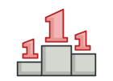
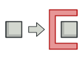

  

  <h3 align="center">Design Patterns</h3>

  

    From Chaos to Clarity: Design Patterns for a Harmonious World
  

 

# What's a design pattern?

**Design patterns** are typical solutions to commonly occurring problems in software design. They are like pre-made blueprints that you can customize to solve a recurring design problem in your code.

 

# What does the pattern consist of?
Most patterns are described very formally so people can reproduce them in many contexts. Here are the sections that are usually present in a pattern description:

- **Intent** of the pattern briefly describes both the problem and the solution.
- **Motivation** further explains the problem and the solution the pattern makes possible.
- **Structure** of classes shows each part of the pattern and how they are related.
- **Code example** in one of the popular programming languages makes it easier to grasp the idea behind the pattern.

 

# Why should you care?
The truth is that you might manage to work as a programmer for many years without knowing about a single pattern. A lot of people do just that. Even in that case, though, you might be implementing some patterns without even knowing it. So why would you spend time learning them?

- Design patterns are a toolkit of tried and tested solutions to common problems in software design. Even if you never encounter these problems, knowing patterns is still useful because it teaches you how to solve all sorts of problems using principles of object-oriented design.

- Design patterns define a common language that you and your teammates can use to communicate more efficiently. You can say, “Oh, just use a Singleton for that,” and everyone will understand the idea behind your suggestion. No need to explain what a singleton is if you know the pattern and its name.

 

# Classification of patterns
Design patterns differ by their complexity, level of detail and scale of applicability to the entire system being designed.

- **Creational** patterns provide object creation mechanisms that increase flexibility and reuse of existing code.

- **Structural** patterns explain how to assemble objects and classes into larger structures, while keeping the structures flexible and efficient.

- **Behavioral** patterns take care of effective communication and the assignment of responsibilities between objects.

# Design patterns Catalog
## Creational Patterns
<table align="center" width="100%" border="1">
  <tr>
    <td align="center">
        
        

          <a href="./docs/singleton.md">Singleton</a>
        

    </td>
    <td align="center">
        
        

          <a href="./docs/builder.md">Builder</a>
        

    </td>
    <td align="center">
        
        

          <a href="./docs/factory.md">Factory</a>
        

    </td>
    <td align="center">
        
        

          <a href="./docs/prototype.md">Prototype</a>
        

    </td>
  </tr>
</table>

## Structural patterns
<table align="center" width="100%" border="1">
  <tr>
    <td align="center">
        
        

          <a href="./docs/proxy.md">Proxy</a>
        

    </td>
    <td align="center">
        
        

          <a href="./docs/decorator.md">Decorator</a>
        

    </td>
    <td align="center">
        
        

          <a href="./docs/facade.md">Facade</a>
        

    </td>
    <td align="center">
        
        

          <a href="./docs/adapter.md">Adapter</a>
        

    </td>
  </tr>
</table>

<table align="center" width="100%" border="1">
  <tr>
    <td align="center">
        
        

          <a href="./docs/composite.md">Composite</a>
        

    </td>
    <td align="center">
        
        

          <a href="./docs/bridge.md">Bridge</a>
        

    </td>
    <td align="center">
        
        

          <a href="#">Flyweight</a>
        

    </td>
  </tr>
</table>

## Behavioral patterns
<table align="center" width="100%" border="1">
  <tr>
    <td align="center">
        
        

          <a href="#">Observer</a>
        

    </td>
    <td align="center">
        
        

          <a href="#">Memento</a>
        

    </td>
    <td align="center">
        
        

        <a href="#">State</a>
        

    </td>
    <td align="center">
        
        

          <a href="#">Command</a>
        

    </td>
  </tr>
</table>