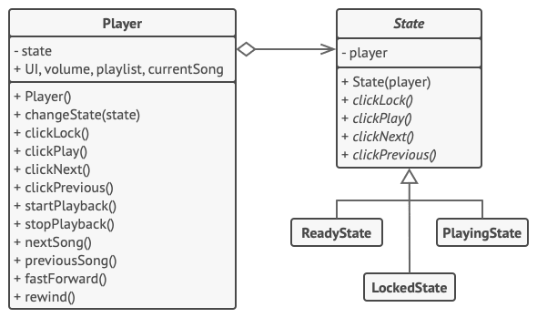

<div align="center" id="top">
  <a href="">
    
  </a>

  <h1 align="center">State</h1>
</div>

<br />

## Intent

**State** is a behavioral design pattern that lets an object alter its behavior when its internal state changes. It appears as if the object changed its class.


## Implementation


1. Decide what class will act as the context. It could be an existing class which already has the state-dependent code; or a new class, if the state-specific code is distributed across multiple classes.

2. Declare the state interface. Although it may mirror all the methods declared in the context, aim only for those that may contain state-specific behavior.

3. For every actual state, create a class that derives from the state interface. Then go over the methods of the context and extract all code related to that state into your newly created class.

4. While moving the code to the state class, you might discover that it depends on private members of the context. There are several workarounds:
- Make these fields or methods public.
- Turn the behavior you’re extracting into a public method in the context and call it from the state class. This way is ugly but quick, and you can always fix it later.
- Nest the state classes into the context class, but only if your programming language supports nesting classes.

5. In the context class, add a reference field of the state interface type and a public setter that allows overriding the value of that field.

6. Go over the method of the context again and replace empty state conditionals with calls to corresponding methods of the state object.

7. To switch the state of the context, create an instance of one of the state classes and pass it to the context. You can do this within the context itself, or in various states, or in the client. Wherever this is done, the class becomes dependent on the concrete state class that it instantiates.


## Structure

<p align="center">
	
</p>

## Pseudocode

In this example, the **State** pattern lets the same controls of the media player behave differently, depending on the current playback state.

<p align="center">
	
</p>

The main object of the player is always linked to a state object that performs most of the work for the player. Some actions replace the current state object of the player with another, which changes the way the player reacts to user interactions.

```java

// The AudioPlayer class acts as a context. It also maintains a
// reference to an instance of one of the state classes that
// represents the current state of the audio player.
class AudioPlayer {
    private State state;
    private UserInterface UI;
    private int volume;
    private String playlist;
    private String currentSong;

    public AudioPlayer() {
        this.state = new ReadyState(this);

        // Context delegates handling user input to a state
        // object. Naturally, the outcome depends on what state
        // is currently active, since each state can handle the
        // input differently.
        UI = new UserInterface();
        UI.lockButton.onClick(this::clickLock);
        UI.playButton.onClick(this::clickPlay);
        UI.nextButton.onClick(this::clickNext);
        UI.prevButton.onClick(this::clickPrevious);
    }

    // Other objects must be able to switch the audio player's
    // active state.
    public void changeState(State state) {
        this.state = state;
    }

    // UI methods delegate execution to the active state.
    public void clickLock() {
        state.clickLock();
    }

    public void clickPlay() {
        state.clickPlay();
    }

    public void clickNext() {
        state.clickNext();
    }

    public void clickPrevious() {
        state.clickPrevious();
    }

    // A state may call some service methods on the context.
    public void startPlayback() {
        // ...
    }

    public void stopPlayback() {
        // ...
    }

    public void nextSong() {
        // ...
    }

    public void previousSong() {
        // ...
    }

    public void fastForward(int time) {
        // ...
    }

    public void rewind(int time) {
        // ...
    }
}

// The base state class declares methods that all concrete
// states should implement and also provides a backreference to
// the context object associated with the state. States can use
// the backreference to transition the context to another state.
abstract class State {
    protected AudioPlayer player;

    // Context passes itself through the state constructor. This
    // may help a state fetch some useful context data if it's
    // needed.
    public State(AudioPlayer player) {
        this.player = player;
    }

    public abstract void clickLock();

    public abstract void clickPlay();

    public abstract void clickNext();

    public abstract void clickPrevious();
}

// Concrete states implement various behaviors associated with a
// state of the context.
class LockedState extends State {

    // When you unlock a locked player, it may assume one of two
    // states.
    public void clickLock() {
        if (player.isPlaying()) {
            player.changeState(new PlayingState(player));
        } else {
            player.changeState(new ReadyState(player));
        }
    }

    public void clickPlay() {
        // Locked, so do nothing.
    }

    public void clickNext() {
        // Locked, so do nothing.
    }

    public void clickPrevious() {
        // Locked, so do nothing.
    }
}

// They can also trigger state transitions in the context.
class ReadyState extends State {
    public void clickLock() {
        player.changeState(new LockedState(player));
    }

    public void clickPlay() {
        player.startPlayback();
        player.changeState(new PlayingState(player));
    }

    public void clickNext() {
        player.nextSong();
    }

    public void clickPrevious() {
        player.previousSong();
    }
}

class PlayingState extends State {
    public void clickLock() {
        player.changeState(new LockedState(player));
    }

    public void clickPlay() {
        player.stopPlayback();
        player.changeState(new ReadyState(player));
    }

    public void clickNext() {
        if (event.doubleclick) {
            player.nextSong();
        } else {
            player.fastForward(5);
        }
    }

    public void clickPrevious() {
        if (event.doubleclick) {
            player.previous();
        } else {
            player.rewind(5);
        }
    }
}

```